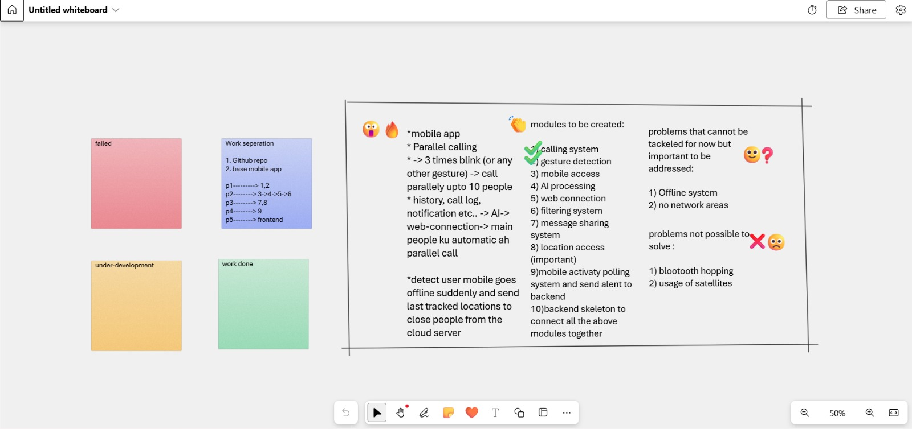

# HelpLink:SFC (Secured Faction Cluster)

An intelligent emergency response system that ensures timely assistance during critical situations using advanced algorithms, smartwatch integration, and voice activation technology.

> **AICTE Activity Point Programme — PSG College of Technology**
> Bachelor of Engineering — Computer Science and Engineering (AI&ML)

## Team Members

| Name | Roll No |
|---|---|
| Divya Nandini R | 23N217 |
| Nivashini N | 23N234 |
| Latshana PR | 23N223 |
| Suryaprakash B | 23N257 |
| Sai Karthi Balaji G | 23N243 |

---

## Project Planning



---

## Modules to be Created

| # | Module | Status |
|---|--------|--------|
| 1 | Calling System | In Progress |
| 2 | Gesture Detection | In Progress |
| 3 | Mobile Access | In Progress |
| 4 | AI Processing | In Progress |
| 5 | Web Connection | In Progress |
| 6 | Filtering System | In Progress |
| 7 | Message Sharing System | In Progress |
| 8 | Location Access | In Progress |
| 9 | Mobile Activity Polling & Alert System | In Progress |
| 10 | Backend Skeleton (connect all modules) | In Progress |

---

## Tech Stack

| Layer | Technology |
|-------|------------|
| **Frontend** | React Native (Expo) |
| **Backend** | Python (FastAPI) |
| **API Docs** | Swagger UI (auto-generated) |

---

## Project Structure

```
HELP-LINK-SFC/
├── frontend/          # React Native (Expo) mobile app
│   ├── app/           # Screens & navigation (expo-router)
│   ├── components/    # Reusable UI components
│   ├── constants/     # App constants & config
│   ├── hooks/         # Custom React hooks
│   ├── assets/        # Images, fonts, icons
│   └── package.json
├── backend/           # FastAPI Python backend
│   ├── main.py        # API entry point
│   └── requirements.txt
├── docs/              # Documentation & images
│   └── project-planning.png
└── README.md
```

---

## Getting Started

To get the system fully running, you need to start three components in separate terminals.

### Prerequisites

- **Node.js** (v18+) — [Download](https://nodejs.org/)
- **Python** (v3.10+) — [Download](https://www.python.org/)
- **Expo Go** app on your phone — [Android](https://play.google.com/store/apps/details?id=host.exp.exponent) | [iOS](https://apps.apple.com/app/expo-go/id982107779)

---

### Step 1: Start the Backend (FastAPI)
The backend manages location data and emergency triggers.
```bash
cd backend
python -m venv venv
.\venv\Scripts\activate  # On Windows
source venv/bin/activate # On Unix
pip install -r requirements.txt
uvicorn main:app --host 0.0.0.0 --port 8000
```
**API Docs:** [http://localhost:8000/docs](http://localhost:8000/docs)

---

### Step 2: Start the Public Tunnel (Ngrok)
Required for the tracking links to work on the public internet.
```bash
npx -y ngrok http 8000
```
1. Copy the `https://...` URL from the terminal.
2. This URL changes every time you restart Ngrok.

---

### Step 3: Update & Start the Frontend (Expo)
1. **Configure API URL**: Open `frontend/services/emergency.ts` and update `BACKEND_URL`:
   ```typescript
   export const BACKEND_URL = 'https://YOUR-NEW-NGROK-ID.ngrok-free.app';
   ```
2. **Launch App**:
   ```bash
   cd frontend
   npx expo start
   ```
3. Scan the QR code with **Expo Go** on your phone.

---

## How to Test Public Tracking
1. Trigger an SOS in the app.
2. Emergency contacts will receive an SMS with a link.
3. Open that link on any device with internet access to see the live map.
---

## Key Features

- **Emergency Pattern Activation** — Unlock and trigger SOS without a password
- **Parallel Calling** — Simultaneously contact up to 10 emergency contacts
- **Gesture Detection** — 3-time blink or custom gesture triggers emergency mode
- **Smart Contact Prioritization** — AI ranks contacts by proximity and relationship
- **Voice Command Activation** — Hands-free emergency triggering
- **Smartwatch Integration** — Auto-detect abnormal pulse and trigger alerts
- **Real-time Location Tracking** — GPS location shared with emergency contacts
- **Offline Detection** — Sends last known location when device goes offline

---

## Known Limitations

### Cannot be tackled now (but important):
1. Offline system support
2. No-network area coverage

### Not possible to solve:
1. Bluetooth hopping
2. Usage of satellites

---

## License

This project is part of the AICTE Activity Point Programme at PSG College of Technology, Coimbatore.
